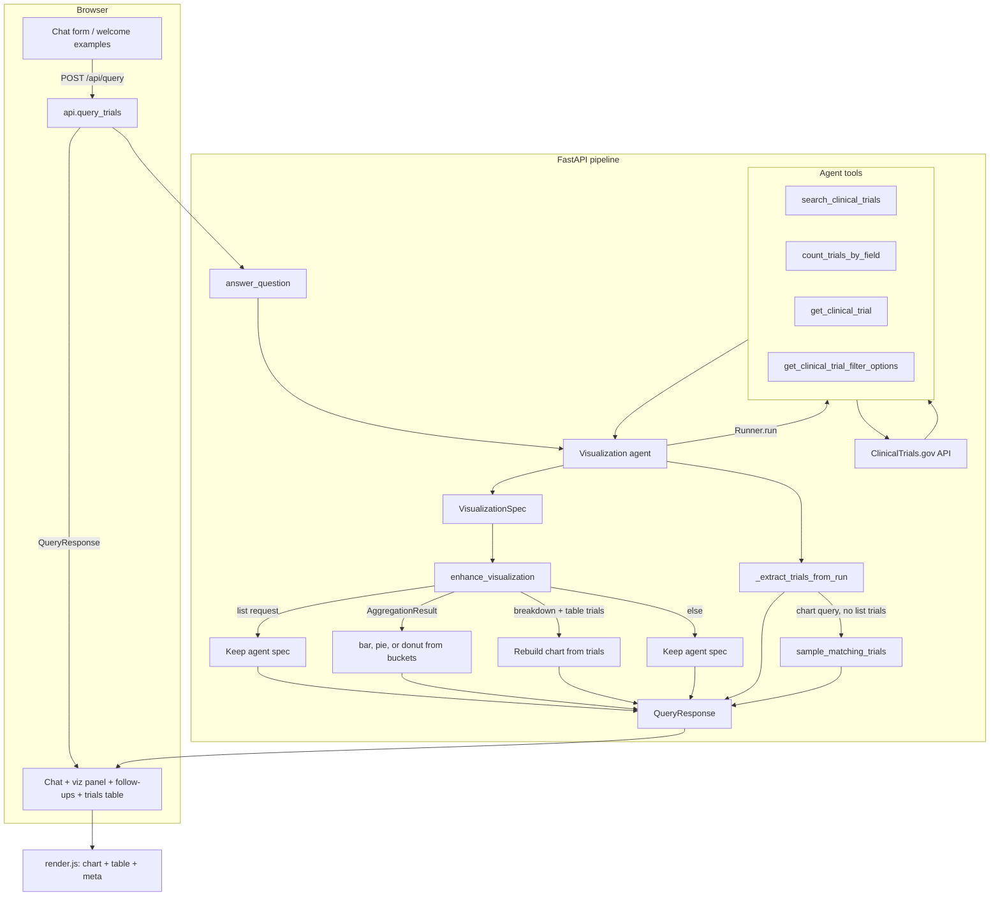

# Clinical Trial Visualization Agent

AI-powered backend that lets users ask questions about clinical trials in plain English. The system interprets intent, queries [ClinicalTrials.gov](https://clinicaltrials.gov/), analyzes results, and returns a structured visualization specification for a frontend to render.

**Live demo:** [https://clinical-trial-visualization-agent-chi.vercel.app/](https://clinical-trial-visualization-agent-chi.vercel.app/)  
**API docs (Swagger):** [https://clinical-trial-visualization-agent-chi.vercel.app/docs](https://clinical-trial-visualization-agent-chi.vercel.app/docs)  
**Demo video:** [Google Drive walkthrough](https://drive.google.com/file/d/1HFjyqS4_mUVKbI1op6sQEVnIAUDlhiEk/view?usp=sharing)

## Submission deliverables

This repository satisfies the assignment checklist as follows:

| # | Requirement | Location |
|---|-------------|----------|
| 1 | **Code** — all source to run the service | This repo (`app/`, `main.py`, `pyproject.toml`, `templates/`, `static/`) |
| 2 | **README** — install/configure/start, schemas, design, limitations | Sections below |
| 3 | **Example runs** — 3–5 queries with actual JSON outputs | [`examples/`](examples/) (5 live captures from deployed API) |
| 4 | **Demo (optional)** | [Live UI](https://clinical-trial-visualization-agent-chi.vercel.app/) + [Swagger](https://clinical-trial-visualization-agent-chi.vercel.app/docs) + [demo video](https://drive.google.com/file/d/1HFjyqS4_mUVKbI1op6sQEVnIAUDlhiEk/view?usp=sharing) |

## How to run

### Install

```bash
uv sync
cp .env.example .env
# Edit .env and set OPENAI_API_KEY
```

For tests and CI tooling:

```bash
uv sync --group dev
```

### Configure

Configuration is loaded from `.env` via `app/config.py` (pydantic-settings). See `.env.example` for all supported variables.

| Variable | Description | Default |
|----------|-------------|---------|
| `OPENAI_API_KEY` | OpenAI API key (required for queries) | — |
| `OPENAI_MODEL` | Model passed to the agent | `gpt-4.1-mini` |
| `API_HOST` / `API_PORT` | Server bind address | `0.0.0.0` / `8000` |
| `CORS_ORIGINS` | Comma-separated origins, or `*` | `*` |
| `ENVIRONMENT` | `development` enables reload and requires `.venv` for `main.py` | `development` |
| `VENV_DIR` | Project virtualenv directory | `.venv` |
| `AGGREGATION_TOP_N` | Max buckets and chart trial samples in API responses | `15` |
| `AGGREGATION_TOP_N_MIN` / `MAX` | Allowed range for `AGGREGATION_TOP_N` | `5` / `100` |
| `AGENT_TOOL_MAX_TRIALS` | Max trial rows returned in agent tool output (TPM guard) | `10` |
| `AGENT_TOOL_MAX_TITLE_CHARS` | Truncate trial titles in tool output | `120` |
| `AGENT_TOOL_MAX_CONDITIONS` | Max conditions per trial in tool output | `2` |
| `CHART_PIE_MAX_BUCKETS` | Use pie/donut instead of bar when bucket count ≤ this | `6` |
| `CHAT_CONTEXT_MAX_MESSAGES` | Prior chat messages sent to the agent per request (`0` = disabled) | `6` |
| `CLINICAL_TRIALS_BASE_URL` | ClinicalTrials.gov API base URL | see `.env.example` |
| `CLINICAL_TRIALS_TIMEOUT` | HTTP timeout (seconds) | `30` |
| `CLINICAL_TRIALS_MAX_PAGE_SIZE` | Upper bound for API `pageSize` | `200` |
| `CLINICAL_TRIALS_SCAN_PAGE_SIZE` | Page size when scanning for sponsor/condition aggregation | `1000` |

### Start

**Web UI (local):**

```bash
python main.py --serve
```

Open [http://localhost:8000](http://localhost:8000). With `ENVIRONMENT=development`, the server auto-reloads and re-execs into `.venv` when present.

**CLI:**

```bash
python main.py "Show recruiting diabetes trials by phase"
python main.py --repl
```

**HTTP API:**

```bash
curl -X POST http://localhost:8000/api/query \
  -H "Content-Type: application/json" \
  -d '{"question": "How many recruiting phase 3 lung cancer trials are there?"}'
```

**Deployed:**

```bash
curl -X POST https://clinical-trial-visualization-agent-chi.vercel.app/api/query \
  -H "Content-Type: application/json" \
  -d '{"question": "How many recruiting phase 3 lung cancer trials are there?"}'
```

## Request / response schema

### Input — `POST /api/query`

| Field | Type | Required | Description |
|-------|------|----------|-------------|
| `question` | string (1–2000 chars) | yes | Natural-language clinical-trial question |
| `history` | array of `{ role, content }` | no | Prior chat turns for multi-turn context (`user` or `assistant`; assistant text is the summary, not full chart JSON) |

Example:

```json
{
  "question": "Break that down by sponsor",
  "history": [
    {"role": "user", "content": "How many recruiting lung cancer trials are there by phase?"},
    {"role": "assistant", "content": "There are 412 recruiting lung cancer trials across five phase categories."}
  ]
}
```

Validation: Pydantic `QueryRequest` rejects off-topic questions with **422** unless they are valid clinical follow-ups given `history`.

### Output — `QueryResponse`

| Field | Type | Description |
|-------|------|-------------|
| `question` | string | Echo of the user question |
| `visualization` | `VisualizationSpec` | Chart/table spec for the frontend |
| `follow_questions` | string[] | 2–3 suggested next questions |
| `trials` | `TrialSummary[]` | Source NCT records for traceability (sampled when needed) |

**`VisualizationSpec`**

| Field | Type | Description |
|-------|------|-------------|
| `chart_type` | enum | `bar`, `pie`, `donut`, `line`, `table`, `metric_cards`, `grouped_bar`, `network`, `timeseries` |
| `title` | string | Chart title |
| `summary` | string | Plain-language answer |
| `data` | object[] | Rows mapped to chart marks or table cells |
| `encoding` | object | Field mapping (`x`, `y`, `color`, `label`, `value`) |
| `x_axis` / `y_axis` | object | Optional axis labels |
| `meta` | object | Filters applied, totals, aggregation source, etc. |

**`TrialSummary`**

| Field | Type |
|-------|------|
| `nct_id`, `title`, `status`, `phases`, `conditions`, `sponsor`, `study_type`, `enrollment`, `start_date` | see OpenAPI at `/docs` |

### HTTP status codes

| Status | Meaning |
|--------|---------|
| `200` | Success (`QueryResponse`) |
| `422` | Invalid or off-topic question |
| `429` | OpenAI token rate limit (TPM) exceeded |
| `503` | Missing `OPENAI_API_KEY` or other configuration error |
| `500` | Unexpected agent or server error |

Full schema: run locally and open [http://localhost:8000/docs](http://localhost:8000/docs), or use the [deployed Swagger UI](https://clinical-trial-visualization-agent-chi.vercel.app/docs).

## Example runs

Five actual JSON responses from the deployed API are in [`examples/`](examples/):

| Query | Output file | `chart_type` |
|-------|-------------|--------------|
| How many recruiting diabetes trials are there by phase? | [01_breakdown_by_phase.json](examples/01_breakdown_by_phase.json) | `pie` |
| List recruiting Parkinson disease trials with NCT IDs | [02_trial_list_table.json](examples/02_trial_list_table.json) | `table` |
| Show a network graph of sponsors and conditions for recruiting diabetes trials | [03_network_graph.json](examples/03_network_graph.json) | `network` |
| Show a time series of lung cancer trials started per year | [04_time_series.json](examples/04_time_series.json) | `timeseries` |
| How many active not recruiting COVID-19 vaccine trials are there? | [05_single_count.json](examples/05_single_count.json) | `bar` |

Abbreviated sample (breakdown query):

```json
{
  "question": "How many recruiting diabetes trials are there by phase?",
  "visualization": {
    "chart_type": "pie",
    "title": "Recruiting Diabetes Trials by Phase",
    "summary": "There are 1937 recruiting diabetes clinical trials distributed across phases…",
    "data": [
      {"label": "Phase 2", "count": 156},
      {"label": "Phase 3", "count": 103}
    ],
    "encoding": {"x": "label", "y": "count"},
    "meta": {"total_trials": 1937, "aggregation_source": "count_total"}
  },
  "follow_questions": ["Show me recruiting diabetes trials by sponsor", "…"],
  "trials": [{"nct_id": "NCT05970237", "title": "…", "status": "RECRUITING"}]
}
```

See the full files in `examples/` for complete payloads including all buckets and sampled trials.

## Design decisions and tradeoffs

**OpenAI Agents SDK + structured output.** The agent calls ClinicalTrials.gov tools and returns a Pydantic-validated `AgentVisualizationOutput`. This separates *data retrieval* (tools) from *presentation* (visualization spec) and gives the frontend a stable contract.

**Two-stage chart selection.** The LLM picks an initial chart type from prompt rules; `enhance_visualization` in `pipeline.py` deterministically overrides when tool outputs make a better choice obvious (e.g. aggregation buckets → bar/pie, network/time-series questions → rebuild from trial rows). Tradeoff: slightly more backend logic, but far more consistent charts than prompt-only selection.

**ClinicalTrials.gov API v2 integration.** Counts use the stats API or `countTotal` when possible (exact, fast). Sponsor/condition breakdowns with filters may require a paginated scan — accurate but slower. High-cardinality dimensions are capped to `AGGREGATION_TOP_N` with an "Other" bucket to limit payload size and OpenAI TPM usage.

**Compact tool outputs.** Tool responses sent back to the model are trimmed (trial title length, condition count, max rows) via `AGENT_TOOL_MAX_*` settings. The API response can still attach up to `AGGREGATION_TOP_N` trials for traceability. Tradeoff: list-view titles in tool path may be truncated; counts and chart data remain exact.

**Scope guard.** Regex-based clinical-question validation rejects obvious off-topic input before invoking the agent, saving cost and preventing misuse. Short contextual follow-ups are allowed when prior turns were clinical.

**Evaluation without OpenAI Evals.** A 27-case dataset plus pytest covers schema validation and deterministic chart-type rules in CI; optional `--run-integration` smoke tests hit the live agent when an API key is present.

## Limitations and future improvements

**Limitations**

- Depends on OpenAI API availability, latency, and per-minute token limits; broad queries or long chat history can trigger TPM errors.
- Sponsor/condition aggregations with many filters rely on sampling or capped buckets — tail categories roll into "Other".
- Network and time-series charts are built from sampled trials (up to `AGGREGATION_TOP_N`), not exhaustive graph analytics over all matching studies.
- Agent behavior can vary by model; chart post-processing mitigates but does not eliminate all inconsistencies.
- ClinicalTrials.gov field coverage is limited to summary modules fetched by the client (not full protocol text).

**With more time**

- Retry/backoff and request queuing for OpenAI rate limits; optional response caching for identical queries.
- Precomputed aggregations or ClinicalTrials.gov stats endpoints for more dimensions without full scans.
- Stronger eval harness with live agent scoring over the full dataset; regression snapshots for chart types.
- Auth and per-user rate limiting for a public deployment.
- Export charts (PNG/PDF) and shareable query links.

## Demo

- **Web UI:** [https://clinical-trial-visualization-agent-chi.vercel.app/](https://clinical-trial-visualization-agent-chi.vercel.app/) — chat interface with chart panel, follow-up chips, and trials table.
- **API:** [https://clinical-trial-visualization-agent-chi.vercel.app/docs](https://clinical-trial-visualization-agent-chi.vercel.app/docs) — interactive Swagger UI.
- **Demo video:** [Google Drive walkthrough](https://drive.google.com/file/d/1HFjyqS4_mUVKbI1op6sQEVnIAUDlhiEk/view?usp=sharing)

The frontend renders `VisualizationSpec` with **Chart.js** (bar, pie, donut, line, metric cards, table) and **D3.js** (grouped bar, network, time series). NCT IDs link to `https://clinicaltrials.gov/study/{nct_id}`.

## Tech stack

| Layer | Technologies |
|-------|----------------|
| **Backend** | Python 3.13, FastAPI, Uvicorn |
| **AI / agent** | OpenAI Agents SDK — tool-calling agent with structured `VisualizationSpec` output |
| **Data** | [ClinicalTrials.gov API v2](https://clinicaltrials.gov/data-api/api) |
| **Validation** | Pydantic v2 (`QueryRequest`, response schemas, clinical-question guards) |
| **Frontend** | Jinja2 templates, vanilla JavaScript, Chart.js, D3.js |
| **Deploy** | Vercel (`app.api:app` via `[tool.vercel]` in `pyproject.toml`) |
| **CI / eval** | GitHub Actions, pytest, pytest-html, `evaluation/dataset.json` |

## How it works

The web UI posts questions to `POST /api/query`. The backend runs an OpenAI Agents SDK agent, post-processes the result, and returns a `QueryResponse` the frontend renders.



### Agent tools

- **count_trials_by_field** — aggregate trial counts by status, phase, sponsor, condition, or study type (preferred for chart questions)
- **search_clinical_trials** — list individual trials with filters; `page_size` defaults to and is capped by `AGGREGATION_TOP_N`
- **get_clinical_trial** — fetch a single trial by NCT ID
- **get_clinical_trial_filter_options** — valid status/phase/study_type codes and query param names

The agent returns a `VisualizationSpec` plus `follow_questions`. `pipeline.py` runs `enhance_visualization` to correct chart types when needed and `_extract_trials_from_run` to attach source trial records for traceability. For chart/count queries, if no trials came back from tool outputs, the pipeline samples up to `AGGREGATION_TOP_N` matching trials. Follow-ups are exposed only at the top level of `QueryResponse`.

### Chart type selection

Chart type is chosen in two stages:

1. **Agent** — follows prompt rules (bar for counts/comparisons, pie/donut for small part-to-whole sets, table only for explicit list requests, etc.)
2. **Post-processing** (`enhance_visualization`) — evaluated in order:
   - List-style questions → keep the agent's choice
   - Network graph questions + trial rows → force `network` (sponsor ↔ condition links from trials)
   - Time series questions + trial rows → force `timeseries` (trial counts bucketed by start date)
   - `AggregationResult` from `count_trials_by_field` → force bar, pie, or donut (pie/donut if bucket count ≤ `CHART_PIE_MAX_BUCKETS`, else bar)
   - Breakdown question + table-shaped trial data → rebuild chart from trial rows
   - Otherwise → keep the agent's choice

The frontend does not select chart type; it renders whatever `chart_type` is in the response.

## Evaluation

This project uses a lightweight evaluation setup (no OpenAI Evals SDK required) that covers both **software correctness** and **expected visualization behavior**:

| Piece | Location | What it checks |
|-------|----------|----------------|
| Eval dataset | `evaluation/dataset.json` | 27 representative queries (breakdowns, explicit chart types, lists, network, time series, off-topic, follow-ups) |
| Response fixtures | `evaluation/fixtures/` | Sample `QueryResponse` / `AgentVisualizationOutput` JSON for schema validation |
| Schema tests | `tests/test_schemas.py` | Pydantic validation for requests, specs, and fixtures |
| Guard tests | `tests/test_clinical_validation.py` | Off-topic rejection and clinical follow-up rules |
| Chart-type tests | `tests/test_chart_type.py` | Deterministic assertions on post-processing chart selection |

Deterministic tests exercise `enhance_visualization` with mocked aggregation/trial data so CI does not call OpenAI or ClinicalTrials.gov. Optional live agent checks are marked `integration` and skipped unless you opt in.

```bash
# Install dev dependencies
uv sync --group dev

# Deterministic eval suite (fast, no API keys)
uv run pytest

# Include live agent smoke tests (requires OPENAI_API_KEY)
uv run pytest --run-integration

# Generate a local HTML report (same format as CI)
uv run pytest --html=pytest-report/report.html --self-contained-html
```

### CI

GitHub Actions runs the deterministic pytest suite on every push/PR to `main` (see `.github/workflows/test.yml`). The workflow uploads a self-contained HTML report as a workflow artifact named `pytest-report` — download it from the Actions run summary.

To extend the eval set, add a case to `evaluation/dataset.json` with `expect` fields such as `preferred_chart_type`, `asks_for_list`, or `enhanced_chart_type_with_aggregation`.
