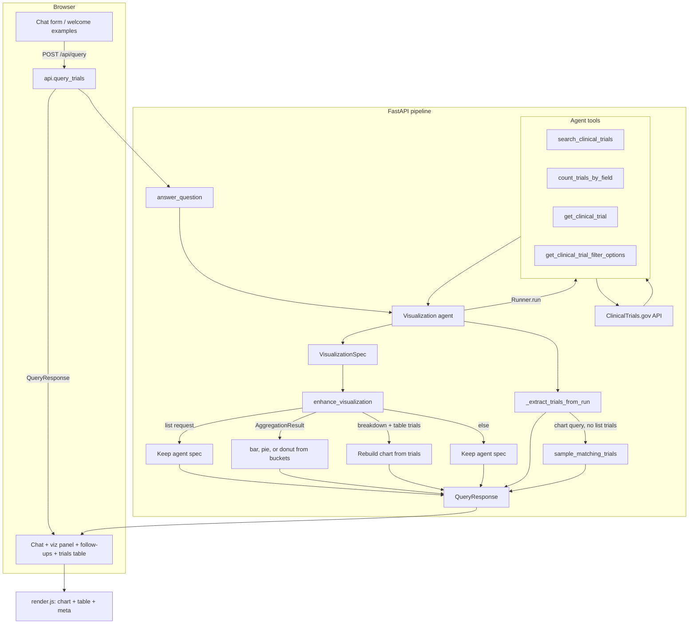

# Clinical Trial Visualization Agent

AI-powered backend that lets users ask questions about clinical trials in plain English. The system interprets intent, queries [ClinicalTrials.gov](https://clinicaltrials.gov/), analyzes results, and returns a structured visualization specification for a frontend to render.

**Live demo:** [https://clinical-trial-visualization-agent-chi.vercel.app/](https://clinical-trial-visualization-agent-chi.vercel.app/)  
**API docs (Swagger):** [https://clinical-trial-visualization-agent-chi.vercel.app/docs](https://clinical-trial-visualization-agent-chi.vercel.app/docs)

## Tech stack

| Layer | Technologies |
|-------|----------------|
| **Backend** | Python 3.13, FastAPI, Uvicorn |
| **AI / agent** | OpenAI Agents SDK — tool-calling agent with structured `VisualizationSpec` output |
| **Data** | [ClinicalTrials.gov API v2](https://clinicaltrials.gov/data-api/api) |
| **Validation** | Pydantic v2 (`QueryRequest`, response schemas, clinical-question guards) |
| **Frontend** | Jinja2 templates, vanilla JavaScript, Chart.js, D3.js |
| **Deploy** | Vercel (`app.api:app` via `[tool.vercel]` in `pyproject.toml`) |

## How it works

The web UI posts questions to `POST /api/query`. The backend runs an OpenAI Agents SDK agent, post-processes the result, and returns a `QueryResponse` the frontend renders.



### Agent tools

- **count_trials_by_field** — aggregate trial counts by status, phase, sponsor, condition, or study type (preferred for chart questions)
- **search_clinical_trials** — list individual trials with filters; `page_size` defaults to and is capped by `AGGREGATION_TOP_N`
- **get_clinical_trial** — fetch a single trial by NCT ID
- **get_clinical_trial_filter_options** — valid status/phase/study_type codes and query param names

The agent returns a `VisualizationSpec` plus `follow_questions`. `pipeline.py` runs `enhance_visualization` to correct chart types when needed and `_extract_trials_from_run` to attach source trial records for traceability. For chart/count queries, if no trials came back from tool outputs, the pipeline samples up to `AGGREGATION_TOP_N` matching trials. Follow-ups are exposed only at the top level of `QueryResponse`.

### Chart type selection

Chart type is chosen in two stages:

1. **Agent** — follows prompt rules (bar for counts/comparisons, pie/donut for small part-to-whole sets, table only for explicit list requests, etc.)
2. **Post-processing** (`enhance_visualization`) — evaluated in order:
   - List-style questions → keep the agent's choice
   - Network graph questions + trial rows → force `network` (sponsor ↔ condition links from trials)
   - Time series questions + trial rows → force `timeseries` (trial counts bucketed by start date)
   - `AggregationResult` from `count_trials_by_field` → force bar, pie, or donut (pie/donut if bucket count ≤ `CHART_PIE_MAX_BUCKETS`, else bar)
   - Breakdown question + table-shaped trial data → rebuild chart from trial rows
   - Otherwise → keep the agent's choice

The frontend does not select chart type; it renders whatever `chart_type` is in the response.

## Setup

```bash
# Install dependencies (recommended)
uv sync

# Configure environment variables
cp .env.example .env
# Edit .env and set OPENAI_API_KEY
```

Configuration is loaded from `.env` via `app/config.py` (pydantic-settings). See `.env.example` for all supported variables.

| Variable | Description | Default |
|----------|-------------|---------|
| `OPENAI_API_KEY` | OpenAI API key (required for queries) | — |
| `OPENAI_MODEL` | Model passed to the agent | `gpt-4.1-mini` |
| `API_HOST` / `API_PORT` | Server bind address | `0.0.0.0` / `8000` |
| `CORS_ORIGINS` | Comma-separated origins, or `*` | `*` |
| `ENVIRONMENT` | `development` enables reload and requires `.venv` for `main.py` | `development` |
| `VENV_DIR` | Project virtualenv directory | `.venv` |
| `AGGREGATION_TOP_N` | Max buckets and chart trial samples in API responses | `15` |
| `AGGREGATION_TOP_N_MIN` / `MAX` | Allowed range for `AGGREGATION_TOP_N` | `5` / `100` |
| `AGENT_TOOL_MAX_TRIALS` | Max trial rows returned in agent tool output (TPM guard) | `10` |
| `AGENT_TOOL_MAX_TITLE_CHARS` | Truncate trial titles in tool output | `120` |
| `AGENT_TOOL_MAX_CONDITIONS` | Max conditions per trial in tool output | `2` |
| `CHART_PIE_MAX_BUCKETS` | Use pie/donut instead of bar when bucket count ≤ this | `6` |
| `CHAT_CONTEXT_MAX_MESSAGES` | Prior chat messages sent to the agent per request (`0` = disabled) | `6` |
| `CLINICAL_TRIALS_BASE_URL` | ClinicalTrials.gov API base URL | see `.env.example` |
| `CLINICAL_TRIALS_TIMEOUT` | HTTP timeout (seconds) | `30` |
| `CLINICAL_TRIALS_MAX_PAGE_SIZE` | Upper bound for API `pageSize` | `200` |
| `CLINICAL_TRIALS_SCAN_PAGE_SIZE` | Page size when scanning for sponsor/condition aggregation | `1000` |

## Usage

### Web UI

**Deployed:** [https://clinical-trial-visualization-agent-chi.vercel.app/](https://clinical-trial-visualization-agent-chi.vercel.app/)

**Local:**

```bash
python main.py --serve
```

With `ENVIRONMENT=development`, the server auto-reloads and re-execs into `.venv` when present. Open [http://localhost:8000](http://localhost:8000) in your browser. The Jinja frontend renders `VisualizationSpec` responses with **Chart.js** (bar, pie, donut, line, metric cards, table) and **D3.js** (grouped bar).

### HTTP API (JSON)

**Swagger UI**

- Deployed: [https://clinical-trial-visualization-agent-chi.vercel.app/docs](https://clinical-trial-visualization-agent-chi.vercel.app/docs)
- Local: [http://localhost:8000/docs](http://localhost:8000/docs)

`POST /api/query` may return:

| Status | Meaning |
|--------|---------|
| `200` | Success (`QueryResponse`) |
| `422` | Invalid or off-topic question |
| `429` | OpenAI token rate limit (TPM) exceeded |
| `503` | Missing `OPENAI_API_KEY` or other configuration error |
| `500` | Unexpected agent or server error |

**Deployed:**

```bash
curl -X POST https://clinical-trial-visualization-agent-chi.vercel.app/api/query \
  -H "Content-Type: application/json" \
  -d '{"question": "How many recruiting phase 3 lung cancer trials are there?"}'
```

**Local:**

```bash
python main.py --serve
```

```bash
curl -X POST http://localhost:8000/api/query \
  -H "Content-Type: application/json" \
  -d '{"question": "How many recruiting phase 3 lung cancer trials are there?"}'
```

**Multi-turn context:** the web UI sends prior turns in `history`. Each item is `{ "role": "user" | "assistant", "content": "..." }`. The server keeps the last `CHAT_CONTEXT_MAX_MESSAGES` entries (assistant text is the summary, not full chart JSON).

```bash
curl -X POST http://localhost:8000/api/query \
  -H "Content-Type: application/json" \
  -d '{
    "question": "Break that down by sponsor",
    "history": [
      {"role": "user", "content": "How many recruiting lung cancer trials are there by phase?"},
      {"role": "assistant", "content": "There are 412 recruiting lung cancer trials across five phase categories."}
    ]
  }'
```

### CLI

```bash
python main.py "Show recruiting diabetes trials by phase"
python main.py --repl
```

## Evaluation

This project uses a lightweight evaluation setup (no OpenAI Evals SDK required) that covers both **software correctness** and **expected visualization behavior**:

| Piece | Location | What it checks |
|-------|----------|----------------|
| Eval dataset | `evaluation/dataset.json` | 27 representative queries (breakdowns, explicit chart types, lists, network, time series, off-topic, follow-ups) |
| Response fixtures | `evaluation/fixtures/` | Sample `QueryResponse` / `AgentVisualizationOutput` JSON for schema validation |
| Schema tests | `tests/test_schemas.py` | Pydantic validation for requests, specs, and fixtures |
| Guard tests | `tests/test_clinical_validation.py` | Off-topic rejection and clinical follow-up rules |
| Chart-type tests | `tests/test_chart_type.py` | Deterministic assertions on post-processing chart selection |

Deterministic tests exercise `enhance_visualization` with mocked aggregation/trial data so CI does not call OpenAI or ClinicalTrials.gov. Optional live agent checks are marked `integration` and skipped unless you opt in.

```bash
# Install dev dependencies
uv sync --group dev

# Deterministic eval suite (fast, no API keys)
uv run pytest

# Include live agent smoke tests (requires OPENAI_API_KEY)
uv run pytest --run-integration

# Generate a local HTML report (same format as CI)
uv run pytest --html=pytest-report/report.html --self-contained-html
```

### CI

GitHub Actions runs the deterministic pytest suite on every push/PR to `main` (see `.github/workflows/test.yml`). The workflow uploads a self-contained HTML report as a workflow artifact named `pytest-report` — download it from the Actions run summary.

To extend the eval set, add a case to `evaluation/dataset.json` with `expect` fields such as `preferred_chart_type`, `asks_for_list`, or `enhanced_chart_type_with_aggregation`.

## Response shape

```json
{
  "question": "How many recruiting diabetes trials are there by phase?",
  "visualization": {
    "chart_type": "bar",
    "title": "Recruiting Diabetes Trials by Phase",
    "summary": "There are 1,937 recruiting diabetes trials across six phase categories.",
    "data": [
      {"label": "Phase 2", "count": 412},
      {"label": "Phase 3", "count": 318}
    ],
    "encoding": {"x": "label", "y": "count"},
    "x_axis": {"field": "label", "label": "Phase"},
    "y_axis": {"field": "count", "label": "Number of trials"},
    "meta": {
      "total_trials": 1937,
      "search_description": "condition='diabetes'; status=RECRUITING",
      "aggregation_source": "count_total"
    }
  },
  "follow_questions": [
    "How many of these trials are in phase 3?",
    "Show recruiting trials for the same condition"
  ],
  "trials": [
    {
      "nct_id": "NCT01234567",
      "title": "Example Diabetes Study",
      "status": "RECRUITING",
      "phases": ["PHASE3"],
      "conditions": ["Type 2 Diabetes"],
      "sponsor": "Example University"
    }
  ]
}
```

`trials` provides source records for traceability:

- **List queries** — trials returned by `search_clinical_trials`
- **Chart/count queries** — up to `AGGREGATION_TOP_N` trials sampled with the same filters when no list tool was used

NCT IDs in the UI link to `https://clinicaltrials.gov/study/{nct_id}`.

Supported `chart_type` values: `bar`, `pie`, `donut`, `line`, `table`, `metric_cards`, `grouped_bar`, `network`, `timeseries`.

**Network graph example:** *"Show a network graph of sponsors and conditions for recruiting diabetes trials"*

**Time series example:** *"Show a time series of lung cancer trials started per year"*
