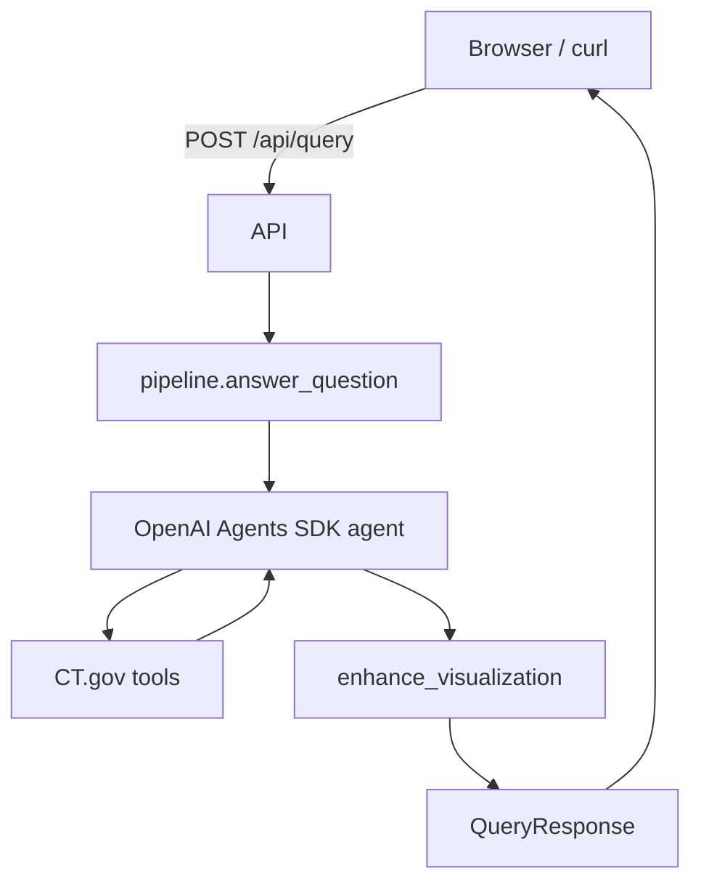

# Clinical Trial Visualization Agent

AI-powered backend that lets users ask questions about clinical trials in plain English. The system interprets intent, queries [ClinicalTrials.gov](https://clinicaltrials.gov/), analyzes results, and returns a structured visualization specification for a frontend to render.

**Live demo:** [clinical-trial-visualization-agent-chi.vercel.app](https://clinical-trial-visualization-agent-chi.vercel.app/)  
**API docs:** [Swagger UI](https://clinical-trial-visualization-agent-chi.vercel.app/docs)  
**Demo video:** [Demo walkthrough](https://drive.google.com/file/d/1HFjyqS4_mUVKbI1op6sQEVnIAUDlhiEk/view?usp=sharing)

## Submission deliverables

| # | Requirement | Location |
|---|-------------|----------|
| 1 | **Code** | `app/`, `main.py`, `pyproject.toml`, `templates/`, `static/` |
| 2 | **README** | This file |
| 3 | **Example runs** (3–5 queries + JSON) | [`examples/`](examples/) |
| 4 | **Demo** | Links above |

## How to run

```bash
uv sync
cp .env.example .env   # set OPENAI_API_KEY
python main.py --serve # http://localhost:8000
```

Tests: `uv sync --group dev` then `uv run pytest`

| Variable | Description | Default |
|----------|-------------|---------|
| `OPENAI_API_KEY` | Required for agent queries | — |
| `OPENAI_MODEL` | Agent model | `gpt-4.1-mini` |
| `AGGREGATION_TOP_N` | Max buckets / trial samples in responses | `15` |
| `AGENT_TOOL_MAX_TRIALS` | Max trial rows in agent tool output (TPM guard) | `10` |
| `CHAT_CONTEXT_MAX_MESSAGES` | Prior chat turns sent to agent (`0` = off) | `6` |

See `.env.example` for all variables (API host, CORS, ClinicalTrials.gov timeouts, etc.).

**CLI:** `python main.py "Show recruiting diabetes trials by phase"` or `python main.py --repl`

**API:**

```bash
curl -X POST http://localhost:8000/api/query \
  -H "Content-Type: application/json" \
  -d '{"question": "How many recruiting phase 3 lung cancer trials are there?"}'
```

Use the [deployed URL](https://clinical-trial-visualization-agent-chi.vercel.app/api/query) for the hosted service. Multi-turn: include `history` as `{ "role": "user"|"assistant", "content": "..." }[]`.

## Request / response schema

### Input — `POST /api/query`

| Field | Type | Required | Description |
|-------|------|----------|-------------|
| `question` | string (1–2000) | yes | Clinical-trial question in plain English |
| `history` | `{ role, content }[]` | no | Prior chat turns (assistant text = summary, not chart JSON) |

Off-topic questions return **422** unless they are valid clinical follow-ups given `history` (Pydantic `QueryRequest`).

### Output — `QueryResponse`

| Field | Type | Description |
|-------|------|-------------|
| `question` | string | Echo of the user question |
| `visualization` | `VisualizationSpec` | Chart/table spec for the frontend |
| `follow_questions` | string[] | 2–3 suggested next questions |
| `trials` | `TrialSummary[]` | Source NCT records for traceability |

`VisualizationSpec` includes `chart_type` (`bar`, `pie`, `donut`, `line`, `table`, `metric_cards`, `grouped_bar`, `network`, `timeseries`), `title`, `summary`, `data`, `encoding`, optional axes, and `meta`. Full field list: Swagger UI linked above.

| Status | Meaning |
|--------|---------|
| `200` | Success |
| `422` | Invalid / off-topic question |
| `429` | OpenAI TPM rate limit |
| `503` | Missing `OPENAI_API_KEY` |
| `500` | Server error |

## Example runs

Five actual responses from the deployed API ([`examples/`](examples/)):

| Query | File | `chart_type` |
|-------|------|--------------|
| How many recruiting diabetes trials are there by phase? | [01_breakdown_by_phase.json](examples/01_breakdown_by_phase.json) | `pie` |
| List recruiting Parkinson disease trials with NCT IDs | [02_trial_list_table.json](examples/02_trial_list_table.json) | `table` |
| Network graph of sponsors and conditions for recruiting diabetes trials | [03_network_graph.json](examples/03_network_graph.json) | `network` |
| Time series of lung cancer trials started per year | [04_time_series.json](examples/04_time_series.json) | `timeseries` |
| How many active not recruiting COVID-19 vaccine trials? | [05_single_count.json](examples/05_single_count.json) | `bar` |

## How it works



**Agent tools:** `count_trials_by_field` (charts/counts), `search_clinical_trials` (lists), `get_clinical_trial` (NCT lookup), `get_clinical_trial_filter_options` (enum codes, last resort).

**Chart selection:** the agent picks an initial type from prompt rules; `enhance_visualization` overrides deterministically when tool output makes the right choice obvious (aggregation → bar/pie/donut, network/time-series → rebuild from trial rows, list questions → keep table). The frontend renders whatever `chart_type` is returned.

## Design decisions and tradeoffs

- **Structured agent output** — separates data retrieval (tools) from presentation (`VisualizationSpec`), giving the frontend a stable contract.
- **Two-stage chart selection** — more consistent than prompt-only; trades extra backend logic for reliability.
- **ClinicalTrials.gov v2** — stats API / `countTotal` when possible; paginated scan for filtered sponsor/condition breakdowns; high-cardinality buckets capped with "Other".
- **Compact tool outputs** — `AGENT_TOOL_MAX_*` trims payloads to the model; API responses can still attach up to `AGGREGATION_TOP_N` trials.
- **Scope guard** — regex-based off-topic rejection before invoking the agent; clinical follow-ups allowed with prior context.

## Tools, validation, and implementation

### Tools used

OpenAI Agents SDK, ClinicalTrials.gov API v2, FastAPI, Pydantic v2, pytest, GitHub Actions, Chart.js, D3.js, Vercel. API correctness is tested with pytest + Pydantic (not Newman/Postman).

### How correctness was validated

1. **Pydantic schemas** — request/response validation; off-topic guard returns 422.
2. **Eval dataset** — 27 queries in `evaluation/dataset.json` with expected chart-type intent.
3. **Deterministic pytest** — `enhance_visualization`, clinical guards, fixture JSON; no OpenAI/CT.gov calls in CI.
4. **CI** — GitHub Actions (`.github/workflows/test.yml`) uploads a pytest HTML report artifact.
5. **Live captures** — five full responses in `examples/`.
6. **Live agent smoke tests** — `uv run pytest --run-integration` (local only, requires `OPENAI_API_KEY`; not run in CI).

```bash
uv sync --group dev
uv run pytest
uv run pytest --html=pytest-report/report.html --self-contained-html
```

| Test file | What it checks |
|-----------|----------------|
| `tests/test_schemas.py` | Pydantic validation |
| `tests/test_clinical_validation.py` | Off-topic / follow-up guards |
| `tests/test_chart_type.py` | Deterministic chart-type selection |
| `tests/test_compact.py` | Tool output trimming |

Iteration: TPM limits → compact tool outputs and shorter prompt; chart inconsistencies → `enhance_visualization` layer.

### Deliberately designed vs generated and adapted

**Designed:** CT.gov client and aggregation (`client.py`, `aggregation.py`, `metadata.py`), agent tools + compact output (`tools.py`, `compact.py`), pipeline and chart post-processing (`pipeline.py`, `visualization_builder.py`), clinical guards, eval harness and CI.

**Generated and adapted:** initial FastAPI/UI scaffold, agent prompt (iterated after testing), README and example captures.

## Limitations and future improvements

**Limitations:** OpenAI latency/TPM limits; sponsor/condition tail buckets roll into "Other"; network/time-series built from sampled trials; model output can vary; summary-level CT.gov fields only.

**With more time:** rate-limit retry/caching, more stats-based aggregations, live-agent eval scoring, auth/rate limiting, chart export, shareable query links.
