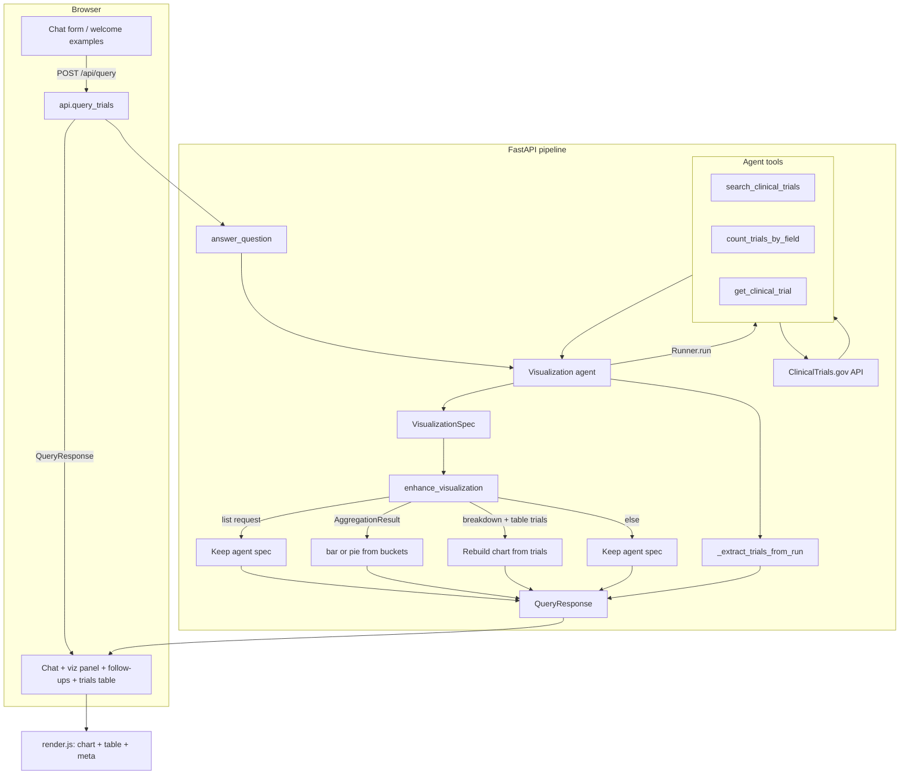

# Clinical Trial Visualization Agent

AI-powered backend that lets users ask questions about clinical trials in plain English. The system interprets intent, queries [ClinicalTrials.gov](https://clinicaltrials.gov/), analyzes results, and returns a structured visualization specification for a frontend to render.

## How it works

The web UI posts questions to `POST /api/query`. The backend runs an OpenAI Agents SDK agent, post-processes the result, and returns a `QueryResponse` the frontend renders.



### Agent tools

- **search_clinical_trials** — search and list trials with filters (condition, intervention, sponsor, status, phase)
- **get_clinical_trial** — fetch a single trial by NCT ID
- **count_trials_by_field** — aggregate trial counts by status, phase, sponsor, condition, or study type (preferred for bar/pie charts)

The agent returns a `VisualizationSpec` with chart type, data rows, axis encoding, summary text, follow-up questions, and metadata. `pipeline.py` then runs `enhance_visualization` to correct chart types when needed and `_extract_trials_from_run` to attach a sample of underlying trial rows.

### Chart type selection

Chart type is chosen in two stages:

1. **Agent** — follows prompt rules (bar for counts/comparisons, pie for ≤6 categories, table only for explicit list requests, etc.)
2. **Post-processing** (`enhance_visualization`) — evaluated in order:
   - List-style questions → keep the agent's choice
   - `AggregationResult` from `count_trials_by_field` → force bar or pie (pie if ≤6 buckets, else bar)
   - Breakdown question + table-shaped trial data → rebuild chart from trial rows
   - Otherwise → keep the agent's choice

The frontend does not select chart type; it renders whatever `chart_type` is in the response.

## Setup

```bash
# Install dependencies
uv sync   # or: pip install -e .

# Configure environment variables
cp .env.example .env
# Edit .env and set OPENAI_API_KEY
```

Configuration is loaded from `.env` via `app/config.py` (pydantic-settings). See `.env.example` for all supported variables.

| Variable | Description | Default |
|----------|-------------|---------|
| `OPENAI_API_KEY` | OpenAI API key (required for queries) | — |
| `OPENAI_MODEL` | Model passed to the agent | `gpt-4.1` |
| `API_HOST` / `API_PORT` | Server bind address | `0.0.0.0` / `8000` |
| `CORS_ORIGINS` | Comma-separated origins, or `*` | `*` |
| `CLINICAL_TRIALS_*` | API URL, timeout, page size | see `.env.example` |

## Usage

### Web UI

```bash
python main.py --serve
```

Open [http://localhost:8000](http://localhost:8000) in your browser. The Jinja frontend renders
`VisualizationSpec` responses with **Chart.js** (bar, pie, line) and **D3.js** (grouped bar).

### HTTP API (JSON)

```bash
python main.py --serve
```

```bash
curl -X POST http://localhost:8000/api/query \
  -H "Content-Type: application/json" \
  -d '{"question": "How many recruiting phase 3 lung cancer trials are there?"}'
```

### CLI

```bash
python main.py "Show recruiting diabetes trials by phase"
python main.py --repl
```

## Response shape

```json
{
  "question": "How many recruiting diabetes trials are there by phase?",
  "visualization": {
    "chart_type": "bar",
    "title": "Recruiting Diabetes Trials by Phase",
    "summary": "Among the sampled recruiting diabetes trials...",
    "data": [{"phase": "Phase 2", "count": 12}],
    "encoding": {"x": "phase", "y": "count"},
    "meta": {"total_trials": 50, "search_description": "condition='diabetes'; status=RECRUITING"}
  },
  "follow_questions": [
    "How many of these trials are in phase 3?",
    "Show recruiting trials for the same condition"
  ],
  "trials": []
}
```

Supported `chart_type` values: `bar`, `pie`, `line`, `table`, `metric_cards`, `grouped_bar`.
